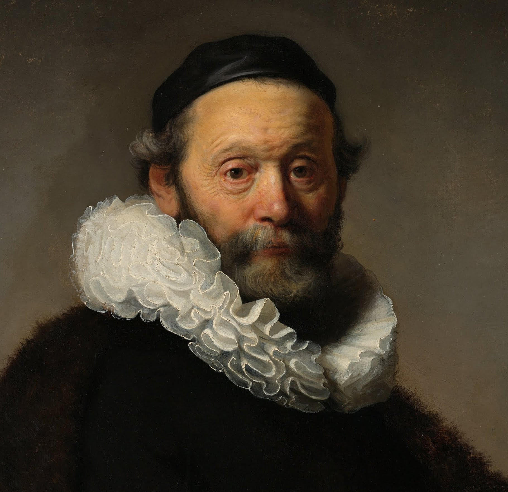

# painting-classifier
Tensorflow image classifier for paintings of van Gogh and Rembrandt. 

Code based on [Siraj's video](https://www.youtube.com/watch?v=QfNvhPx5Px8&t=46s) and [Google codelab](https://codelabs.developers.google.com/codelabs/tensorflow-for-poets/?utm_campaign=chrome_series_machinelearning_063016&utm_source=gdev&utm_medium=yt-desc#0) tutorial. 

Created using Docker toolbox. 

Example Rembrandt: 

Example van Gogh: 

Predictions of classifier are in the screenshot but were both correct.
